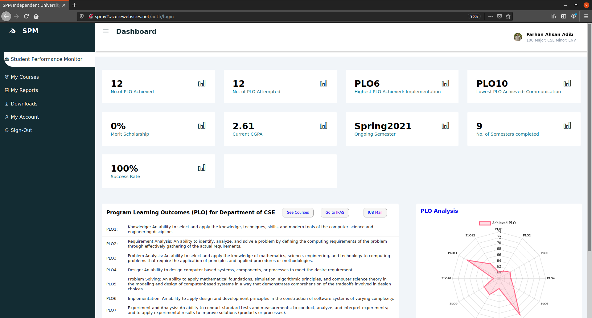

# Student Performance Monitoring System
This is a cloud based application written in Node (Express) to monitor the performances of students from Independent University, Bangladesh. 

## Dependencies
1. Node.js
2. NPM

## Login Credentials
Visit : https://spmv2.azurewebsites.net/

A few dummy users have already been created in the database. Information of 6 such users from 6 different user categories are shown below.
* Student:
    - Username: 100
    - Password: 100
* Faculty:
    - Username: 4321
    - Password: 4321
* Head:
    - Username: 1234
    - Password: 1234
* Dean:
    - Username: 5678
    - Password: 5678
* VC:
    - Username: 1011
    - Password: 1011
* Admin:
    - Username: 12354
    - Password: 12345

## Contributers
* Tahmid Hossain
* Nawar Anzara
* Sabrina Masum Meem
* Nusrat Jahan Nur Saba
* Farhan Ahsan Adib
* Shakil Ahmed

